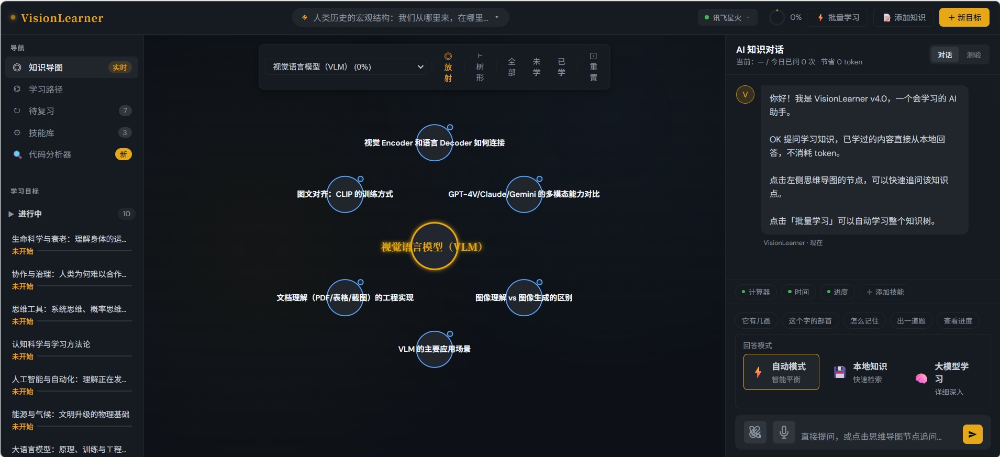
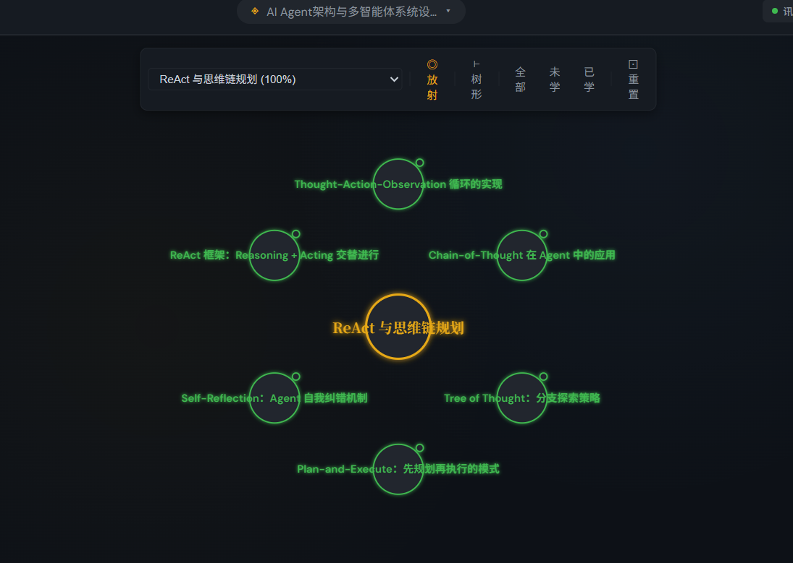
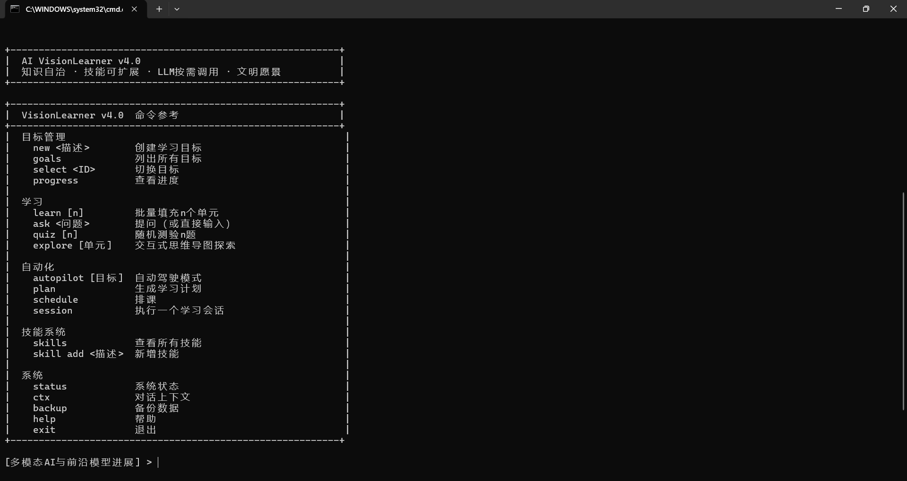

<div align="center">

# 🧠 VisionLearner v4.2

**新一代自主认知学习系统**

> **LLM 是老师，只用来学习；系统自己是学生，学会了就自己回答。**

[](https://github.com)
[](https://www.python.org)
[](LICENSE)
[]()

**知识自治 · 技能可扩展 · LLM 按需调用 · 越用越聪明**

[快速开始](#-快速开始) • [功能特性](#-核心特性) • [使用示例](#-使用示例) • [架构设计](#-架构设计) • [API文档](#-web-api)

---

## 📸 界面预览

### Web 模式主界面

> 现代化 Web UI，支持响应式布局，手机电脑均可使用

### 思维导图可视化

> 交互式思维导图，点击节点查看详情

### 命令行模式

> 高效便捷的命令行界面

---


## 📌 核心设计理念

### 🎯 突破传统 AI 系统的瓶颈

传统 AI 系统每次回答都依赖 LLM，token 不断消耗，没有任何积累：

```
用户提问 → 调用 LLM → 返回答案 → 消耗 token
用户再问 → 调用 LLM → 返回答案 → 再消耗 token
用户再问 → 调用 LLM → 返回答案 → 再消耗 token
...
```

**VisionLearner 颠覆了这个模式：**

```
用户提问
  ↓
① 技能系统检测？      → 有 → 直接执行（0 token）
  ↓ 无
② 知识库已有？        → 有 → 直接回答（0 token）
  ↓ 无
③ 调 LLM 学习        → 学会 → 存入知识库（少量 token，仅此一次）
                             → 下次直接回答（0 token）
```

**核心优势：用的越多，消耗越少。每个知识点只学一次，永久记住。**

---

## ✨ 核心特性

### 🎓 内置完整知识体系

系统预置了 **14 个领域**的完整知识体系，共 **130 个单元**、**697 个知识节点**，开箱即用：

#### 📚 基础领域（8个）
- **🧠 认知科学与学习方法论** - 学会学习，效率翻倍（11单元，60节点）
- **🧩 思维工具** - 系统思维、概率思维、第一性原理（14单元，72节点）
- **🤖 人工智能与自动化** - AI 原理、大模型、AGI（13单元，67节点）
- **⚡ 能源与气候** - 热力学、核能、气候变化（13单元，66节点）
- **🤝 协作与治理** - 信任机制、民主、全球协作（11单元，55节点）
- **🧬 生命科学与衰老** - 细胞、DNA、长寿干预（13单元，72节点）
- **📜 人类历史的宏观结构** - 认知革命、农业革命、工业革命（12单元，60节点）
- **📣 表达与传播** - 写作、演讲、说服（10单元，46节点）

#### 🚀 AI 前沿知识（6个）
- **🔥 大语言模型：原理、训练与工程实践** - Transformer架构、预训练、指令微调（6单元，37节点）
- **🔍 RAG系统设计与工程实践** - 向量数据库、文档分块、检索策略（5单元，31节点）
- **🤖 AI Agent架构与多智能体系统设计** - Agent本质、ReAct规划、工具调用（7单元，43节点）
- **💻 代码智能体：AI辅助软件工程** - 代码理解、代码生成、自动测试（5单元，28节点）
- **🌈 多模态AI与前沿模型进展** - 视觉语言模型、扩散模型、推理模型（4单元，24节点）
- **🛠️ AI应用工程：从原型到生产** - LLM应用设计、LangChain、可观测性（6单元，36节点）

### 🌐 双模式交互

**命令行模式（CLI）** - 高效便捷，适合开发者
- 简洁命令接口
- 自动补全和历史记录
- 支持脚本自动化

**Web 模式** - 现代美观，适合所有用户
- 响应式设计，支持手机访问
- 交互式思维导图
- 实时进度追踪
- 可视化学习面板

### 🧩 三层智能架构

```
┌─────────────────────────────────────────────────┐
│  用户提问                                          │
└────────────────┬────────────────────────────────┘
                 │
        ┌────────▼─────────┐
        │  层1: 技能检测    │ ← 计算器、时间、翻译等 → 0 token
        └────────┬─────────┘
                 │ 否
        ┌────────▼─────────┐
        │  层2: 知识检索    │ ← 语义搜索 → 0 token
        └────────┬─────────┘
                 │ 否
        ┌────────▼─────────┐
        │  层3: LLM 学习    │ ← 生成内容 → 100-300 token（仅一次）
        └────────┬─────────┘
                 │
        ┌────────▼─────────┐
        │  存入知识库       │ ← 永久记住
        └──────────────────┘
```

### 🚀 自动驾驶模式

一键完成完整学习流程：

```
autopilot 学习10个常用汉字
  ↓
✅ 目标创建 → ✅ 思维导图生成 → ✅ 学习计划
  ↓
✅ 智能排课 → ✅ 自动学习 → ✅ 进度监控
  ↓
🎉 完成！7步，100%完成度
```

### 📊 智能进度追踪

- **单元级别** - 实时统计已学习单元数
- **节点级别** - 精确计算知识节点掌握度
- **完成率** - 动态更新学习进度
- **可视化** - 进度条、百分比、详细报表

### 🧠 对话上下文自治

系统自己维护对话状态，不依赖 LLM 理解上下文：

```
用户: "蠢字怎么读"
系统: [识别新知识] → 调用LLM学习 → 存入知识库 → 返回答案

用户: "它有几画"       ← 系统自己解析"它"= "蠢"
系统: [知识库命中] → 直接返回答案（0 token）

用户: "这个字的含义"   ← 无需重复说明
系统: [知识库命中] → 直接返回答案（0 token）
```

### 🔌 可扩展技能系统

**内置技能：**
- 🔢 计算器 - 数学计算
- ⏰ 时间/日期 - 查询当前时间
- 📈 学习进度 - 查看学习统计

**自定义技能：**
```bash
skill add 帮我把中文翻译成英文
→ 系统自动生成技能文件 → 注册到技能库 → 立即可用
```

### 🧪 测验系统

- 随机出题检验学习效果
- 自动评分
- 支持自定义题目数量
- 涵盖所有已学知识点

### 🔄 多 LLM 支持

| 优先级 | 提供商 | 是否免费 | 中文能力 | 国内可用 |
|--------|--------|----------|----------|----------|
| 1 | Ollama（本地） | 永久免费 | ⭐⭐⭐⭐⭐ | ✅ |
| 2 | DeepSeek | 低价 | ⭐⭐⭐⭐⭐ | ✅ |
| 3 | 讯飞星火 | 有限免费 | ⭐⭐⭐⭐⭐ | ✅ |
| 4 | 豆包 | 付费 | ⭐⭐⭐⭐⭐ | ✅ |
| 5 | 硅基流动 | 注册送额度 | ⭐⭐⭐⭐⭐ | ✅ |
| 6 | Groq | 免费额度 | ⭐⭐⭐⭐ | ❌需代理 |

---

## 🚀 快速开始

### 1️⃣ 环境准备

**系统要求：**
- Python 3.8 或更高版本
- pip 包管理器
- （可选）Ollama（本地运行）

**安装依赖：**
```bash
pip install -r requirements.txt
```

**必需依赖包：**
- `requests` - HTTP 请求
- `flask` - Web 服务
- `schedule` - 任务调度
- `python-dotenv` - 环境变量管理
- `networkx` - 图算法（思维导图）
- `chromadb` - 向量数据库
- `sentence-transformers` - 文本嵌入

### 2️⃣ 配置 LLM

创建 `.env` 文件，至少选择一个 LLM 配置：

#### 🥇 方案A：Ollama（推荐，永久免费）

```bash
# 1. 下载并安装 Ollama
# https://ollama.ai/download

# 2. 拉取中文模型
ollama pull qwen2.5:7b      # 中文效果最好

# 3. 启动 Ollama 服务（自动运行）
# 无需配置，系统自动检测
```

#### 🥈 方案B：讯飞星火（国内免费）

```bash
# 注册：https://console.xfyun.cn
SPARK_API_PASSWORD=your_password
```

#### 🥉 方案C：DeepSeek（低价，推荐）

```bash
# 注册：https://platform.deepseek.com
DEEPSEEK_API_KEY=your_key
```

#### 其他选项

```bash
# 豆包
DOUBAO_API_KEY=your_key

# Groq 免费额度
GROQ_API_KEY=your_key

# 硅基流动 免费额度
SILICONFLOW_API_KEY=your_key
```

### 3️⃣ 导入知识体系（可选）

系统已预置完整知识体系，首次使用建议导入：

```bash
# 导入8个基础领域
python import_knowledge_plan.py

# 导入6个AI前沿知识
python import_ai_knowledge.py
```

**导入后自动生成 14 个学习目标：**
```
✅ 认知科学与学习方法论（11单元，60节点）
✅ 思维工具（14单元，72节点）
✅ 人工智能与自动化（13单元，67节点）
...（共14个目标）
```

### 4️⃣ 启动系统

#### 方式一：Web 模式（推荐）⭐

```bash
python main.py --web
# 或双击"启动Web服务.bat"
```

**启动成功后：**
```
╔══════════════════════════════════════════════════════════╗
║  🌐 VisionLearner Web UI 已启动                          ║
╠══════════════════════════════════════════════════════════╣
║  本机：  http://localhost:5000                        ║
║  局域网：http://192.168.x.x:5000        ║
║  手机请确保与电脑在同一WiFi下                             ║
╚══════════════════════════════════════════════════════════╝
```

**浏览器访问：**
- 本机：`http://localhost:5000`
- 局域网：`http://192.168.x.x:5000`（替换为实际IP）
- 手机：确保与电脑在同一WiFi，访问局域网IP

#### 方式二：命令行模式

```bash
python main.py
# 或双击"启动命令行模式.bat"
```

---

## 📖 使用示例

### 🌐 Web 模式使用

#### 1. 选择学习目标

启动 Web 界面后，左侧显示预置的 14 个学习目标：

```
📚 目标列表
  🎯 认知科学与学习方法论 [11单元, 60节点]
  🎯 思维工具 [14单元, 72节点]
  🎯 人工智能与自动化 [13单元, 67节点]
  🎯 大语言模型：原理、训练与工程实践 [6单元, 37节点]
  ...
```

**操作：**
- 点击目标名称切换
- 实时显示当前目标进度

#### 2. 批量学习（推荐）⭐

一键学习多个单元的全部知识点：

```
1. 点击左侧「🚀 批量学习」按钮
2. 输入要学习的单元数量（如：10）
3. 点击「开始学习」

系统自动：
  → 分析未学习的单元
  → 逐个单元调用 LLM 学习
  → 存储到向量知识库
  → 实时更新进度条
```

**进度显示：**
```
📚 批量学习进行中...
  [████████░░░░░░░░░] 60%
  已完成：6/10 单元
  已学习：180 个节点
```

#### 3. 智能提问

**直接提问：**
```
右侧对话框输入：什么是艾宾浩斯遗忘曲线

系统响应：
📖（来自知识库）
艾宾浩斯遗忘曲线是由德国心理学家赫尔曼·艾宾浩斯发现的人类遗忘规律...
（0 token 消耗）
```

**代词解析：**
```
用户: 蠢字怎么读
系统: 「蠢」读作：chǔn（第三声）

用户: 它有几画      ← 系统自动解析"它"= "蠢"
系统: 「蠢」共21画，部首：虫，上下结构
（0 token 消耗）
```

**快捷提示：**
```
系统自动生成快捷提示按钮：
  👉 艾宾浩斯遗忘曲线的应用
  👉 如何提高记忆力
  👉 间隔重复法

点击即可快速提问
```

#### 4. 手动添加知识笔记 🆕

用于记录学习心得、重要知识点：

```
1. 点击右上角「📝 添加知识」按钮
2. 填写表单：
   ├─ 学习目标：选择（自动填充当前目标）
   ├─ 知识单元名称：如"艾宾浩斯遗忘曲线"
   ├─ 知识标题：如"学习心得"（可选）
   └─ 知识内容：输入笔记内容
3. 点击「保存」
```

**示例：**
```
目标：认知科学与学习方法论
单元：艾宾浩斯遗忘曲线
标题：学习心得
内容：遗忘曲线显示记忆在学习后迅速衰减，
前1小时遗忘60%，24小时遗忘70%。
因此需要在关键时间点复习：20分钟后、1小时后、
8小时后、1天后、2天后、6天后、31天后。
```

**保存后：**
- ✅ 存入向量知识库
- ✅ 支持语义检索
- ✅ 可通过问答自动调用

#### 5. 查看思维导图

```
1. 切换到「🗺 思维导图」视图
2. 交互式展示知识网络
   ├─ 放射状图形结构
   ├─ 节点颜色表示学习状态
   ├─ 灰色：未学习
   ├─ 绿色：已学习
   └─ 黄色：学习中
3. 点击节点查看详情：
   ├─ 显示完整内容
   ├─ 支持追问
   └─ 显示相关节点
```

#### 6. 查看学习进度

```
「📊 进度」视图显示：

📊 学习进度报告
━━━━━━━━━━━━━━━━━━━━
总体进度：[██████░░░░░░░] 60%

📚 单元统计
  总单元：130
  已学习：78
  未学习：52

🧠 节点统计
  总节点：697
  已学习：418
  未学习：279

📈 完成度：60.0%
━━━━━━━━━━━━━━━━━━━━
```

#### 7. 创建自定义目标

```
1. 点击右上角「＋ 新目标」按钮
2. 输入目标描述：
   「学习100个常用汉字」
3. 点击「创建」

系统自动：
  → 分析目标内容
  → 生成知识单元列表（100个汉字）
  → 创建思维导图结构
  → 标记为当前目标
```

#### 8. 测验检验

```
1. 切换到「📝 测验」视图
2. 选择题目数量（默认5题）
3. 开始答题

示例：
第1题：「蠢」怎么读？
你的回答: chun
参考答案: chǔn
✅ 正确

第2题：「蠢」是什么意思？
你的回答: 愚笨
参考答案: 愚笨；虫子蠢动
✅ 正确

─────────────────────────
最终得分：100% （5题）
```

### 💻 命令行模式使用

#### 1. 列出可用目标

```
> goals

✅ 可用目标列表：
1. 认知科学与学习方法论 (11单元, 60节点)
2. 思维工具 (14单元, 72节点)
3. 人工智能与自动化 (13单元, 67节点)
4. 大语言模型：原理、训练与工程实践 (6单元, 37节点)
...
```

#### 2. 切换目标

```
> select 1

✅ 已切换到：认知科学与学习方法论
```

#### 3. 批量学习

```
> learn 10

📚 批量填充：10 个单元
  [  0%] 记忆的工作原理: 工作记忆是什么
  [ 10%] 记忆的工作原理: 工作记忆的容量上限（7±2）
  [ 20%] 艾宾浩斯遗忘曲线: 遗忘规律
  ...
✅ 填充完成，共学习 60 个节点
```

#### 4. 提问学习

```
> 什么是艾宾浩斯遗忘曲线

📖（来自知识库）
艾宾浩斯遗忘曲线是由德国心理学家赫尔曼·艾宾浩斯发现的人类遗忘规律...

> 它有什么用      ← 代词解析

📖（来自知识库）
遗忘曲线可以用于指导学习计划，在关键时间点复习...
```

#### 5. 自动驾驶模式

```
> autopilot 学习10个常用汉字

🤖 启动自动驾驶模式...
✅ 目标创建：学习10个常用汉字
✅ 思维导图生成：完成
✅ 学习计划：完成
✅ 排课：完成
✅ 执行会话1：学习了 47 个节点
✅ 执行会话2：学习了 47 个节点
✅ 执行会话3：学习了 46 个节点
✅ 自动驾驶完成：7步，完成度100%
```

#### 6. 技能使用

```
> 100+200等于多少
🔧 100+200 = 300

> 现在几点
🔧 现在是 2026年03月04日 星期三 13:20:55

> 进度
🔧 学习进度：
   [████░░░░░░░░░░░░░░░░] 20%
   总单元：3500 | 已学会：700
```

#### 7. 添加新技能

```
> skill add 帮我把中文翻译成英文

🔧 正在生成技能：帮我把中文翻译成英文
✅ 技能「中英翻译」已创建并注册
   触发词: ['翻译', 'translate', '英文怎么说']

> 蠢用英文怎么说
🔧 stupid / foolish / dumb
```

#### 8. 测验

```
> quiz 5

📝 测验（5题）
────────────────────────────────────────

第1题：「蠢」怎么读？
你的回答: chun
参考答案: chǔn
✅ 正确

第2题：「蠢」是什么意思？
...

────────────────────────────────────────
平均得分：80%  （5题）
```

---

## 🏗️ 架构设计

### 📦 项目结构

```
VisionLearner/
│
├── main.py               # 主程序入口（系统协调器 + CLI + Web Server）
├── web_server.py         # Web 服务器（Flask 应用）
├── heartbeat.py          # 后台心跳调度器（定时复习提醒）
│
├── ── 核心模块 ──
├── collector.py          # 节点收集器（系统"学习"的执行者）
│                         # 思维导图节点 collected=True/False
│                         # 空节点 → 调LLM学习 → 标记已收集
│
├── conversation.py       # 对话上下文管理器（完全不调LLM）
│                         # 代词解析："它" → "蠢"
│                         # 意图识别：读音/笔画/含义/用法...
│
├── skill_manager.py      # 技能系统（可扩展能力）
│                         # 扫描 skills/ 目录自动加载
│                         # LLM生成新技能文件并注册
│
├── llm_client.py         # 统一LLM客户端（免费优先）
│                         # 讯飞 → Ollama → Groq → 豆包 → ...
│
├── storage.py            # 持久化（JSON文件 + 向量数据库）
│
├── ── 算法引擎 ──
├── foundation.py         # 数据模型（MindMapNode, LearningGoal等）
├── planner.py            # 规划层（层次分配、自适应调度）
├── explorer.py           # 探索层（问题引擎、知识网络）
├── perception.py         # 感知层（思维导图生成）
├── vision_core.py        # 文明愿景核心（思想钢印）
│
├── ── Web 前端 ──
├── visionlearner_ui.html # Web UI（单文件，包含 HTML/CSS/JS）
│
├── ── 数据目录（运行后自动创建）──
├── learning_data/        # 所有学习数据
│   ├── goals/            # 学习目标
│   ├── mindmap_trees/    # 思维导图树（每个单元一棵树）
│   ├── goal_units/       # 目标的知识单元列表
│   └── backups/          # 数据备份
│
├── skills/               # 技能文件目录
│   ├── calculator.py     # 内置：计算器
│   ├── timer.py          # 内置：时间日期
│   ├── progress.py       # 内置：学习进度
│   └── *.py              # 你新增的技能...
│
├── cache/                # LLM响应缓存（减少重复调用）
│
├── 启动命令行模式.bat      # Windows 快捷启动脚本
├── 启动Web服务.bat        # Windows 快捷启动脚本
├── requirements.txt
├── .env                   # 环境变量配置（需要手动创建）
├── .env.example           # 配置文件模板
└── README.md
```

### 🧠 思维导图知识树

每个知识单元拥有一棵独立的思维导图树，以汉字"蠢"为例：

```
蠢（根节点）
├── 读音          collected=True   → chǔn
├── 字形
│   ├── 笔画      collected=True   → 21画
│   ├── 部首      collected=True   → 虫
│   └── 结构      collected=False  ← 还没学
├── 含义          collected=True   → 愚笨；蠢动
├── 用法
│   ├── 组词      collected=True   → 愚蠢、蠢货...
│   └── 例句      collected=False  ← 还没学
├── 记忆方法      collected=True   → 春天虫子到处动...
└── 关联
    ├── 形近字    collected=False  ← 还没学
    └── 同音字    collected=False  ← 还没学

掌握度：5/10 = 50%
```

**"学会"的标准：这棵树的所有节点都 collected=True。**

### 🔄 三层智能架构

```
┌─────────────────────────────────────────────────┐
│  用户提问                                          │
└────────────────┬────────────────────────────────┘
                 │
        ┌────────▼─────────┐
        │  层1: 技能检测    │
        │  ├─ 触发词匹配？  │ → 有 → 直接执行（0 token）
        │  └─ 不匹配        │
        └────────┬─────────┘
                 │
        ┌────────▼─────────┐
        │  层2: 知识检索    │
        │  ├─ 语义搜索     │
        │  ├─ 向量匹配     │ → 命中 → 直接返回（0 token）
        │  └─ 未命中       │
        └────────┬─────────┘
                 │
        ┌────────▼─────────┐
        │  层3: LLM 学习    │
        │  ├─ 调用 LLM     │
        │  ├─ 生成内容     │
        │  ├─ 存入向量库   │ → 永久记住
        │  └─ 返回答案     │ ← 仅此一次消耗 token
        └──────────────────┘
```

### 💬 对话上下文自治

系统完全自主维护对话状态，不依赖 LLM 理解上下文：

```python
# 用户说"它有几画"
# 系统自己做（0 次LLM调用）：

# 1. 代词解析
resolved = context.resolve_reference("它有几画")
# → "蠢有几画"（因为 current_topic = "蠢"）

# 2. 意图识别
intent = context.detect_intent("蠢有几画")
# → Intent(type="query", subtype="strokes", entity="蠢")

# 3. 直接查知识树的"笔画"节点
answer = knowledge_tree.find_node("蠢", "笔画")
# → 21画（0 token）
```

### 🔌 技能系统

技能文件是普通 Python 文件，放入 `skills/` 目录即生效：

```python
# skills/my_skill.py
SKILL_NAME = "我的技能"
SKILL_DESC = "功能描述"
TRIGGERS   = ["触发词1", "触发词2"]   # 输入包含这些词时触发

def run(query: str, context: dict) -> str:
    # 处理逻辑
    return "结果"
```

**用 `skill add <描述>` 让系统自动生成技能文件：**

```bash
> skill add 查询今日天气

🔧 正在生成技能：查询今日天气
✅ 技能「天气查询」已创建并注册
   触发词: ['天气', 'weather', '今天天气']
   保存位置: skills/weather_query.py

> 今天天气怎么样
🔧 今天天气：晴，温度 25°C
```

---

## 🔌 Web API

### 目标管理

```http
# 获取所有目标列表
GET /api/goals
Response: {"goals": [{"id": "1", "description": "...", "progress": 60}, ...]}

# 创建新目标
POST /api/goal/new
Body: {"description": "学习100个常用汉字"}
Response: {"ok": true, "goal_id": "new_id"}

# 切换当前目标
POST /api/goal/select
Body: {"goal_id": "1"}
Response: {"ok": true}
```

### 学习与进度

```http
# 提问
POST /api/ask
Body: {"question": "什么是艾宾浩斯遗忘曲线"}
Response: {"answer": "艾宾浩斯遗忘曲线...", "source": "knowledge"}

# 流式提问
GET /stream/ask?question=xxx
Response: Server-Sent Events 流式返回

# 获取思维导图
GET /api/mindmap?goal_id=1
Response: {"tree": {...}, "nodes": [...]}

# 获取学习进度
GET /api/progress?goal_id=1
Response: {"total_units": 130, "learned_units": 78, "progress": 60}

# 批量学习
POST /api/populate
Body: {"limit": 10}
Response: {"ok": true, "learned": 180}

# 添加知识笔记 🆕
POST /api/note/add
Body: {
  "goal_id": "1",
  "unit": "艾宾浩斯遗忘曲线",
  "node_title": "学习心得",
  "content": "遗忘曲线显示..."
}
Response: {"ok": true, "message": "已保存笔记到..."}
```

### 测验

```http
# 获取一道测验题
GET /api/quiz/question
Response: {"question": "...", "options": [...], "answer": "..."}

# 提交答案并评分
POST /api/quiz/check
Body: {"question_id": "xxx", "user_answer": "..."}
Response: {"correct": true, "score": 100}
```

### 自动化

```http
# 自动驾驶模式
POST /api/autopilot
Body: {"description": "学习10个常用汉字"}
Response: {"ok": true, "steps": 7, "progress": 100}

# 获取学习计划
GET /api/plan?goal_id=1
Response: {"plan": [...]}

# 生成排课
POST /api/schedule
Body: {"goal_id": "1"}
Response: {"ok": true, "schedule": [...]}
```

### 系统

```http
# 系统状态
GET /api/status
Response: {"llm": "ok", "cache": "ok", "storage": "ok"}

# 获取技能列表
GET /api/skills
Response: {"skills": [{"name": "calculator", "desc": "..."}]}

# 添加技能
POST /api/skill/add
Body: {"description": "查询今日天气"}
Response: {"ok": true, "skill_name": "天气查询"}

# 备份数据
POST /api/backup
Response: {"ok": true, "backup_path": "..."}
```

---

## 📊 Token 消耗说明

### 消耗策略

| 操作 | Token 消耗 | 说明 |
|------|-----------|------|
| 已学知识的提问 | **0** | 直接从知识库返回 |
| 技能处理的请求 | **0** | 本地执行，无 LLM 调用 |
| 代词解析 / 意图识别 | **0** | 本地算法处理 |
| 学习新知识节点 | **100~300** | 仅此一次，永久记住 |
| 生成新技能文件 | **500** | 仅创建技能时一次 |
| 创建学习目标 | **200** | 生成单元列表 |

### 实际案例

**学习 3500 个汉字：**
```
总消耗 ≈ 3500 字 × 10 节点/字 × 150 token ≈ 500万 token

讯飞星火免费额度：2000万 token/月
结论：完全够用，且学完之后永久 0 token
```

**学习 14 个预置知识体系：**
```
总节点：697 个
总消耗 ≈ 697 × 150 token ≈ 10万 token

结论：一次学习，终身受益
```

### 节省示例

**传统 AI 系统：**
```
问"蠢字怎么读" 100 次 = 100 × 100 token = 10,000 token
问"艾宾浩斯遗忘曲线" 100 次 = 100 × 200 token = 20,000 token
...
月消耗：数百万 token
```

**VisionLearner：**
```
问"蠢字怎么读" 100 次：
  第1次：100 token（学习）
  后99次：0 token（从知识库返回）
  总计：100 token

问"艾宾浩斯遗忘曲线" 100 次：
  第1次：200 token（学习）
  后99次：0 token
  总计：200 token

月消耗：仅数万 token，节省 90%+
```

---

## 🌐 多进程协作

完整使用时，可同时运行三个进程，各司其职、共享数据：

```
┌─────────────────────────────────────────────────┐
│              VisionLearner 多进程架构             │
├─────────────────────────────────────────────────┤
│                                                   │
│  ┌─────────────┐  ┌─────────────┐  ┌───────────┐ │
│  │  主交互进程  │  │  心跳进程    │  │  备份进程  │ │
│  │  main.py    │  │ heartbeat.py│  │  (内置)    │ │
│  │             │  │             │  │           │ │
│  │ • Web 服务  │  │ • 知识探测  │  │ • 数据备份│ │
│  │ • 用户交互  │  │ • 定时复习  │  │ • 数据清理│ │
│  │ • 命令处理  │  │ • 提醒推送  │  │ • 日志归档│ │
│  └──────┬──────┘  └──────┬──────┘  └─────┬─────┘ │
│         │                │                │        │
│         └────────────────┼────────────────┘        │
│                          │                          │
│                    共享数据目录                      │
│              learning_data/ (JSON)                  │
│                                                   │
└─────────────────────────────────────────────────┘
```

**终端1（主交互）：**
```bash
python main.py --web
→ 负责接受你的提问，处理Web请求
```

**终端2（后台心跳）：**
```bash
python heartbeat.py
→ 每2小时自动探测知识盲点并填充
→ 每天早8点/晚9点推送提醒
→ 每天凌晨2点自动备份数据（保留最近30天）
```

**三者共享同一个 `learning_data/` 目录，数据实时互通，不会冲突。**

> 💡 **提示：** 只想简单用的话，只开第一个终端就够了。心跳是可选的锦上添花。

---

## 🔄 版本历史

| 版本 | 发布日期 | 核心变化 |
|------|---------|---------|
| v1.0 | 2025-01 | 原 VisionLearner，豆包+讯飞，基础问答 |
| v3.0 | 2025-02 | 接入免费LLM，JSON持久化，修复算法断层 |
| v3.1 | 2025-02 | 知识卡片引擎（平铺列表结构） |
| v3.2 | 2025-03 | 思维导图树结构，对话自治，技能系统 |
| v4.0 | 2025-03 | **Web 界面、批量学习、自动驾驶、完整测试系统** |
| v4.1 | 2025-03 | **修复完成率计算bug、节点查找bug，内置8大知识体系** |
| v4.2 | 2025-03 | **新增6个AI前沿知识体系、Python 3.14兼容、手动添加知识笔记** |

---

## ❓ 常见问题

### 📚 知识体系相关

**Q: 预置的知识体系是什么，需要自己创建吗？**

A: 系统已内置 14 个完整的学习目标，无需创建：
• 基础领域：认知科学、思维工具、AI、能源、协作、生命科学、历史、表达
• AI 前沿：大语言模型、RAG、AI Agent、代码智能体、多模态、AI应用工程
• 运行 `python import_knowledge_plan.py` 和 `python import_ai_knowledge.py` 即可导入
• 共 130 个单元、697 个知识节点，学习完直接用

**Q: 如何重新导入知识体系？**

A: 如果数据清空后需要重新导入：
```bash
python import_knowledge_plan.py    # 导入8个基础领域
python import_ai_knowledge.py      # 导入6个AI前沿知识
```
会自动生成 14 个目标及其对应的思维导图。

### 🐛 Bug 修复相关

**Q: 为什么完成率显示 83% 而不是 100%？**

A: 这是 v4.0 的一个已修复 bug：
• 问题原因：计算完成率时错误地包含了根节点（depth=0）
• 实际状态：子节点全部学完即可，根节点不需要收集
• 修复版本：v4.1 已修复，现在正确显示 100%

**Q: 提问已学习的知识，为什么还是报 500 错误？**

A: 这是 v4.0 的一个已修复 bug：
• 问题原因：方法名不一致（_find_node_by_title vs _find_best_match）
• 影响：已学习的内容无法被检索到
• 修复版本：v4.1 已修复，现在可以正常回答

### ⚙️ 配置相关

**Q: 启动时提示"未发现可用LLM，使用mock模式"**

A: 说明 `.env` 里没有配置任何LLM密钥，或者 Ollama 没有运行。
• 最简单的方法：安装 Ollama，运行 `ollama pull qwen2.5:7b`，再启动系统
• 或者填入讯飞/豆包的密钥到 `.env` 文件

**Q: 手机打不开网页**

A:
• 确认手机和电脑连的是同一个WiFi
• 用启动时显示的局域网IP（192.168.x.x:5000），不是 localhost
• Windows 防火墙可能需要放行5000端口

### 📖 使用相关

**Q: 问了同一个问题，为什么有时候消耗token有时候不消耗**

A: 这就是三层回答架构的设计：
• 第一次问「蠢字怎么读」→ 调LLM学习，消耗 ~100 token，存入知识库
• 之后再问「蠢字怎么读」或「它怎么读」→ 直接从知识库回答，0 token
• 规律：每个知识点只学一次，之后永远不再消耗token

**Q: learn 命令和直接提问有什么区别**

A:
• 直接提问：按需学习，问什么学什么，token消耗少但只学你问的部分
• learn 50：主动批量学习50个单元的全部节点，一次性消耗较多token，但之后全部命中知识库
• 建议：平时直接提问，偶尔 learn 一批来"预热"

**Q: 数据存在哪里，会不会丢**

A:
• 所有数据存在 `learning_data/` 目录，JSON文件格式，可以直接用文本编辑器打开
• 运行 `backup` 命令创建备份，存到 `learning_data/backups/`
• 心跳调度器每天也会自动备份

### 🔧 技能相关

**Q: skill add 生成的技能出错了怎么办**

A:
• 技能文件在 `skills/` 目录下，每个技能是一个独立的 `.py` 文件
• 可以直接用文本编辑器打开修改，保存后重启系统自动重新加载
• 删除文件即可删除技能

**Q: 如何手动编写技能文件？**

A: 参考现有技能文件格式：
```python
# skills/my_skill.py
SKILL_NAME = "技能名称"
SKILL_DESC = "功能描述"
TRIGGERS   = ["触发词1", "触发词2"]

def run(query: str, context: dict) -> str:
    # 处理逻辑
    return "结果"
```
保存后重启系统即可自动加载。

---

## 📄 许可证

本项目采用 MIT 许可证。详见 [LICENSE](LICENSE) 文件。

---

## 🤝 贡献指南

欢迎贡献代码、报告问题或提出建议！

1. Fork 本项目
2. 创建特性分支 (`git checkout -b feature/AmazingFeature`)
3. 提交更改 (`git commit -m 'Add some AmazingFeature'`)
4. 推送到分支 (`git push origin feature/AmazingFeature`)
5. 开启 Pull Request

---

## 📮 联系方式

如有问题或建议，欢迎通过以下方式联系：

- 提交 Issue
- 发送 Pull Request
- 邮件联系

---

<div align="center">

**VisionLearner - 新一代自主认知学习系统**

Made with ❤️

**目标是造一个真正会学习、越用越聪明的系统**

</div>
